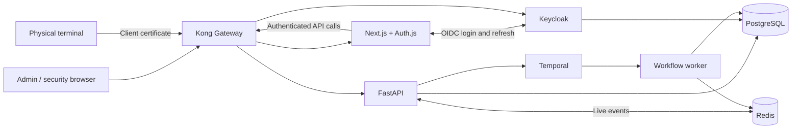

# IN / OUT Management System

A checkpoint management application for employee, visitor, and hardware entry/exit. Administrators manage records and permissions; security operators scan barcodes and act on access decisions. PostgreSQL stores movements and presence, while Keycloak handles login and roles.

[Features](#features) · [Architecture](#architecture) · [Quick start](#quick-start) · [Configuration](#configuration) · [Development](#development-and-testing) · [Test workflows](#test-workflows) · [Benchmarks](#benchmark-workflow) · [API](#api) · [Operations](#operations) · [Troubleshooting](#troubleshooting)

## Features

| Area | What it provides |
| --- | --- |
| Dashboard | Scan totals, entry/exit analytics, presence counts, and recent activity |
| Registry | Employees, temporary visitors, hardware assets, and completed permission/grant history |
| Permissions | Pending reviews, direct administrator grants, current access for every registered subject, and explicit critical-restriction release |
| Security terminal | Barcode scanning, up to four optional carried-hardware barcodes, a fixed account-assigned checkpoint, automatic entry/exit decisions, and persistent results |
| Movement logs | Search and filters, pagination, analytics, and movement notes |
| Alerts and audit | Scheduled attendance rules, accept/excuse review, warning-count reset with critical-hold release, per-employee assignments, and Registry alert history; evaluation every five minutes |
| Offline queue | Device-local scan storage and retry after reconnection; queued scans require a server decision before access is allowed |
| Account and appearance | Keycloak account security, SSO logout, administrator profile preferences, responsive layouts, and shared light/dark themes |

### Roles and pages

| Identity | Access |
| --- | --- |
| `admin` realm role | All admin pages and `/terminal`; scans/manual reviews additionally require a checkpoint assignment |
| `operator` realm role | `/terminal` and its scan/manual-review workflow; no admin pages |
| Keycloak master administrator | Keycloak configuration and identity management; this does not automatically grant an application role |

The `admin` role grants access to every application page, including the security terminal. Scanning requires a checkpoint assignment, and user management requires a recent reauthentication. The `operator` role grants terminal access without admin pages. Keycloak login accounts and registry people are separate: creating a login does not register a person for checkpoint access.

**Manage users** offers unlock durations of **5, 10, 15, 20, or 30 minutes, or 1 hour**, defaulting to **5 minutes**. The window starts at the fresh Keycloak authentication time and keeps its original expiry across reloads and token refreshes. While unlocked, choose from the same six choices under **Extend for** and press **Extend**. Completing a fresh Keycloak sign-in starts a new window for the selected duration; changing the selection alone keeps the old countdown. **Lock** takes effect immediately, including during longer windows. Starting an extension locks the current window until the fresh login completes; canceling that login leaves user management locked.

The local app runs at `localhost:1008` and Keycloak at `auth.localhost:1005`. The distinct hostnames keep their browser cookies isolated; cookies are not isolated by port, and sharing them can overflow identity-provider request headers during step-up authentication.

The Next.js runtime accepts up to **64 KiB of total request headers**, matching the gateway's allowance for a **32 KiB individual Cookie header** plus forwarded headers. Docker and the npm development/start commands use the same Node limit. Kong's **64 KiB response-header buffer** also accepts the complete block of chunked `Set-Cookie` headers. A session spread across Auth.js cookie chunks together with temporary OAuth state, PKCE, and nonce cookies must complete reauthentication without a `431` or an oversized-response `502`. After changing these settings, rebuild/recreate the app (`docker compose up -d --no-deps --build --wait app`) and recreate Kong (`docker compose up -d --no-deps --wait kong`); restarting old containers retains their previous limits.

The facility has two zones: **Main Entrance** (`public`, checkpoint `cp-main`) and **Server Room** (`secure`, checkpoint `server-room`). Access forms select either or both. Legacy `main-gate` scans resolve to `cp-main`; old display-name permissions and `All Zones` normalize to these two identifiers.

Visitor and scheduled-access forms use facility time, **Asia/Kolkata (UTC+05:30)**. Choose a start near now or in the future and an end strictly after it, within the next **six calendar months**. The horizon keeps the same facility time and clamps to the last day when the target month is shorter. Creation allows five minutes of start-time grace for form completion and clock differences; the end must still be in the future. Native calendar limits and submission validation reject invalid or out-of-range typed values, and the backend enforces the same window. Approval can retain a request's past start, but cannot approve an expired window or extend beyond the horizon. Historical movement and report calendars accept past dates and cap their end at now.

In **Permission Manager → New permission**, administrators grant visitor access, zone access, or hardware custody directly. A new visitor's identity, approved decision, access, and audit evidence are saved together; no pending approval is needed for this administrator grant. Registering a visitor in Terminal or through the registry creation API still creates a pending approval. The pending queue shows only undecided requests and removes a request after its decision is saved. **Registry → Permissions** stores completed approvals, denials, and direct grants; **Permission Manager → Access directory** shows current access for every registered person and asset as cards, including entry zones, **Starts** / **Ends** in local time or **No end date**, custody, and available actions.

A critical alert bound to a registered subject blocks new entry independently of ordinary access permissions. Acknowledgement, accepting a review, another grant, or deletion of the source alert by retention does not lift that restriction. A reviewed manual admission allows that visit and its matching exit; later entry remains blocked. In **Alert Command**, **Reset warnings** requires a reason, clears the subject's confirmed warning count, lifts the current critical hold, and keeps every reviewed alert and reset note in **Registry → Alerts**. Excusing an alert is a review decision only and does not lift a hold. A new distinct critical trigger can restrict entry again; replaying an old alert ID cannot. Migration [`s7t8u9v0w1`](backend/alembic/versions/s7t8u9v0w1_critical_entry_restrictions.py) backfills existing critical alerts, including acknowledged alerts, using explicit subject IDs or unique barcodes rather than names.

### Scan and approval workflow

1. An administrator assigns each scanning account a checkpoint in **Manage users**. The terminal displays that fixed checkpoint. Scan a person or asset barcode and optionally add carried hardware, then press **Enter** or **Check access**. Unassigned accounts cannot scan.
2. The backend checks registration, access status, validity, zone, presence, and applicable hardware custody. Automatic checkpoints derive direction from presence; manual checkpoints expose **Entry** and **Exit** controls.
3. The decision and movement are recorded in PostgreSQL. Approved movements update presence; scheduled attendance rules generate alerts separately. Idempotency keys protect scan retries.
4. A denied scan can be sent for **manual approval**, with a required operator note. An administrator decides it in Permission Manager or Dashboard's **Pending Permissions**. Manual approvals offer **Valid for** choices of 15 minutes, 30 minutes, 1 hour, 2 hours, or 4 hours, defaulting to 1 hour; the backend validates these exact choices. Approval grants one rescan at the same checkpoint and direction before the window expires; the person must rescan to enter. The matching exit stays allowed after the window expires.
5. Manual entry approval atomically stores the identity, decision, movement, audit event, and presence. Its window starts at the administrator's decision time, and a retry does not extend it. Matching exit remains allowed after expiry or when normal entry access is restricted. Exit consumes that visit's permission; the original approval cannot authorize another entry. Additional hardware is not covered by the original approval.

**Recent scans** and **Manual reviews** are filtered to the assigned checkpoint. Completed manual-review decisions appear as notices with an optional **×** close control. Closing a notice leaves its decision and records in Terminal Activity and Registry's Permissions history; pending requests cannot be dismissed. The backend checks the assignment before scans, manual reviews, notice dismissal, and scan retries, including when the browser changes the checkpoint in its request. Account security and sign-out are in the terminal's account menu.

Admins can open **Terminal** from the admin sidebar. Its account menu links back to **Dashboard** and **Manage users**. To assign a new operator, open **Manage users**, unlock user management, choose **New user**, enable the **operator** role, and select **Terminal checkpoint** before creating the account. The same field updates an existing user's assignment. An admin can view the terminal without an assignment; scanning requires assigning that admin account a checkpoint too.

The offline queue uses IndexedDB in the same browser and device. Connect once to cache checkpoint and hardware configuration for the signed-in account. Scans queue on supported connection failures, retain their original checkpoint and idempotency keys, and retry after reconnection or through **Retry queued scans**. A reassigned account cannot replay a scan from its old checkpoint; do not rewrite that queued scan to a different checkpoint. This is queued verification, not offline authorization; it does not guarantee the page can first load without a connection.

Certificate-authenticated physical terminals also require a server-side assignment. After applying migrations, provision the exact certificate CN using `docker compose run --rm --no-deps backend-init python -m terminal_assignments --terminal <certificate-CN> --checkpoint cp-main` (or `server-room`). Unknown terminal identities fail closed. Browser assignments use verified Keycloak subject IDs and take effect immediately, without waiting for a new token.

The dashboard uses PostgreSQL summary queries and the operational query indexes directly. Redis delivers live events. See [dashboard latency measurements](docs/dashboard-latency.md) for the local before/after comparison.

## Architecture



Kong Gateway owns the app, API, and Keycloak HTTP listeners. The browser uses the Next.js session/API layer, whose server-side requests reach FastAPI through Kong. Keycloak credentials and refresh tokens are not exposed in public session responses. FastAPI verifies access-token signatures, issuer, audience, expiry, and roles, with signing-key refresh support. Physical terminals can use Kong's optional certificate-authenticated TLS listener, configured in `compose.mtls.yaml` and `gateway/kong.yml`.

| Compose service | Technology / responsibility | Default local address |
| --- | --- | --- |
| `kong` | Kong OSS 3.9.3; DB-less routing, limits, streaming, and terminal identity | Owns ports `1008`, `1002`, and `1005` |
| `app` | Next.js 15, React 19, TypeScript, Auth.js; UI and session/API layer | [localhost:1008](http://localhost:1008), through Kong |
| `python-api` | Python 3.10+, FastAPI, SQLAlchemy, asyncpg | [localhost:1002/docs](http://localhost:1002/docs), through Kong |
| `postgres-primary` | PostgreSQL 17; persistent storage | `localhost:1003` |
| `redis` | Redis 7; live event publication | `localhost:1004` |
| `keycloak` | OIDC identity provider; default image pin `26.2.5` | [auth.localhost:1005/admin](http://auth.localhost:1005/admin), through Kong |
| `temporal` | Durable workflows | gRPC `localhost:1006` |
| `temporal-ui` | Optional workflow inspection UI (`observability` profile) | [localhost:1007](http://localhost:1007) |
| `backend-init` | Alembic migrations, reference seeding, and alert-schedule bootstrap; exits on completion | Internal job |
| `temporal-worker` | Executes approval and alert activities | Internal service |

Application tables hold subjects, people/assets, permissions, requests, presence, movements, scan retry records, alerts, and audit events. Keycloak uses the `keycloak` schema in the `inout` database; Temporal uses separate databases on the same PostgreSQL service. Administrator profiles are associated with the Keycloak identity and do not store login passwords. The PostgreSQL volume persists across normal restarts. Independent local installations do not share accounts or records.

### Repository layout

```text
app/                  Next.js pages, layouts, authentication, and API routes
frontend/components/  Admin and terminal UI
frontend/context/     Shared state, refresh handling, and data actions
frontend/lib/         Persistent offline terminal queue
services/             Browser API clients
lib/                  Shared types, normalization, analytics, and session logic
backend/routers/      FastAPI endpoints
backend/workflows/    Temporal workflows and activities
backend/alembic/      Database migrations
backend/tests/        Policy, authentication, contract, and PostgreSQL tests
keycloak/             Realm import template
gateway/              Kong routes, terminal-identity plugin, and isolated tests
scripts/              Authentication checks and local realm repair
tests/                Frontend contract and authentication tests
BACKEND_FUNCTION_MAP.md Backend endpoints, core functions, and workflows
compose.yaml          Local services and isolated test services
```

Dependency versions are recorded in [package-lock.json](package-lock.json) and [backend/uv.lock](backend/uv.lock). The frontend includes a targeted PostCSS override for the Next.js 15 dependency tree.

## Quick start

**Requirements:** Docker Desktop running, Node.js 22.5+ with npm, and a local checkout. The commands below use PowerShell from the repository root; Python runs inside Docker.

**1. Create configuration for a new installation.** Keep an existing `.env` when updating.

```powershell
Copy-Item .env.example .env
$authSecret = node -e "console.log(require('crypto').randomBytes(32).toString('base64url'))"
$clientSecret = node -e "console.log(require('crypto').randomBytes(32).toString('base64url'))"
(Get-Content .env) -replace '^AUTH_SECRET=.*$', "AUTH_SECRET=$authSecret" -replace '^KEYCLOAK_CLIENT_SECRET=.*$', "KEYCLOAK_CLIENT_SECRET=$clientSecret" | Set-Content .env
```

Set `POSTGRES_PASSWORD`, `KEYCLOAK_ADMIN_USERNAME`, and `KEYCLOAK_ADMIN_PASSWORD` in `.env`. The default application URL is `http://localhost:1008`. Never commit `.env`.

For an **existing realm**, keep its current client secret from **Clients → inout-frontend → Credentials**. Changing `.env` does not rotate the saved secret, and startup import does not overwrite an existing realm. Back up the realm before applying identity changes; make and verify those changes in Keycloak before relying on the updated application configuration.

**2. Build and start.**

```powershell
docker compose up --build -d
docker compose ps -a
```

`-d` runs services in the background. `backend-init` should exit successfully; the API and worker remain running. Startup seeds reference checkpoints and alert rules, registers the durable alert schedule, and does not create application login users.

The Temporal inspection interface is intentionally off by default. Start it only when diagnosing workflows:

```powershell
docker compose --profile observability up -d temporal-ui
```

**3. Create application users.**

1. Open [Keycloak administration](http://auth.localhost:1005/admin) using the master credentials from `.env`.
2. Select the `inout` realm, create a user under **Users**, and set a password under **Credentials**. For immediate local sign-in, turn **Temporary** off.
3. Assign the `admin` realm role under **Role mapping**, preserving default realm roles. Admins can also use the terminal. Create a separate user with `operator` when you want terminal-only access.
4. Sign in at [localhost:1008](http://localhost:1008). After role changes, sign out and back in to obtain updated claims.

**4. Register subjects and operate the terminal.** Use the admin Registry and Permission Manager pages to create people/assets and configure access. Assign the scanning account a checkpoint through **Manage users** before scanning at `/terminal`.

## Configuration

[.env.example](.env.example) lists settings; [compose.yaml](compose.yaml) defines which values each container receives.

| Setting | Purpose |
| --- | --- |
| `POSTGRES_PASSWORD` | Database credentials used by the stack; keep URL-embedded credentials correctly encoded |
| `AUTH_SECRET` | Encrypts/authenticates Auth.js session cookies |
| `AUTH_TRUST_HOST`, `ENV` | Auth.js host handling and backend environment; Compose supplies these for the local stack |
| `KEYCLOAK_ADMIN_USERNAME`, `KEYCLOAK_ADMIN_PASSWORD` | Bootstrap master credentials, used when Keycloak first initializes |
| `KEYCLOAK_CLIENT_ID`, `KEYCLOAK_CLIENT_SECRET` | Frontend client configuration; Compose uses `inout-frontend` and requires its matching secret |
| `AUTH_URL`, `APP_PORT` | Browser-facing application origin and Docker port; keep callback URLs consistent |
| `KEYCLOAK_VERSION`, `KEYCLOAK_PORT` | Server image pin and local identity-provider port |
| `KEYCLOAK_ISSUER`, `KEYCLOAK_ISSUER_PUBLIC`, `KEYCLOAK_JWKS_BASE`, `KEYCLOAK_AUDIENCE` | Token issuer, optional browser-facing issuer override, internal JWKS address, and required API audience |
| `KEYCLOAK_JWKS_CACHE_TTL` | Signing-key cache lifetime; default 300 seconds |
| `PYTHON_API_URL`, `DATABASE_URL`, `READ_DATABASE_URL` | API and database connections; an empty read URL uses the primary database |
| `REDIS_URL`, `TEMPORAL_HOST` | Live-event and workflow connections |
| `PYTHON_API_PORT`, `POSTGRES_PORT`, `REDIS_PORT`, `TEMPORAL_PORT`, `TEMPORAL_UI_PORT` | Host port overrides for the addresses above |
| `KONG_VERSION` | Pinned Kong OSS image version; default `3.9.3` |
| `KONG_TERMINAL_SECRET` | Optional Kong-to-API terminal identity secret, at least 32 random characters |
| `KEYCLOAK_STEP_UP_SIGNING_SECRET` | Backend verification secret for browser user-management proofs; Compose supplies the same value as `AUTH_SECRET` |
| `KONG_TLS_DIR`, `TERMINAL_TLS_PORT` | Certificate directory and listener port for `compose.mtls.yaml` |
| `MAX_REQUEST_BODY_BYTES`, `WRITE_RATE_LIMIT_PER_MINUTE` | API limits; defaults are 262,144 bytes and 300 writes/minute per client address per process |
| `*_RETENTION_DAYS` | Maintenance windows: retry records 30 days; audit events, alerts, and movements default to indefinite retention (`0`) |

Compose supplies internal service addresses; host-side development uses localhost addresses. Backend settings are defined in [backend/config.py](backend/config.py). Settings not forwarded in a service's `environment` must be passed explicitly, for example with `docker compose run -e NAME=value ...`; adding a value to the root `.env` alone does not automatically inject it into every container.

## Development and testing

Install host-side dependencies with `npm ci`. Keep Docker backend services running, then start the frontend with its development callback origin:

```powershell
$env:AUTH_URL = "http://localhost:3001"
npm run dev
```

Open [localhost:3001](http://localhost:3001). The realm template includes this callback; an existing realm must have it registered. Use `npm run dev:webpack` for the Webpack development server. Remove the temporary override with `Remove-Item Env:AUTH_URL` before returning to the Docker application URL. Backend code changes require rebuilding its services through `docker compose up --build -d`.

| Command | Verification |
| --- | --- |
| `npm run typecheck` | TypeScript types |
| `npm test` | Data contracts, session/token handling, and realm-repair behavior |
| `npm run build` | Production frontend build |
| `npm run test:auth:http` | HTTP authentication using isolated identity/API stubs; run after building |
| `npm run test:postgres` | Backend suite, migrations, and transaction behavior against isolated PostgreSQL |
| `npm run test:gateway` | Disposable real Kong, certificate authentication, request limits, and streaming with fixture upstreams |
| `npm run test:auth:account` | Live local Keycloak account endpoints and role boundaries; creates and removes a temporary test identity |

PostgreSQL tests use the `test` Compose profile, a separate temporary database, and a schema per database test. They require Docker and the Compose configuration values. Stop the test service afterward with `docker compose --profile test stop db-test`. The live account check additionally requires the running local stack and matching credentials in `.env`.

[GitHub Actions](.github/workflows/verify.yml) runs frontend type checks, tests, the production build and HTTP authentication checks, plus isolated backend and Kong gateway suites on pull requests and pushes to `main`. Run `npm run test:gateway` locally to verify routing, streaming, traffic limits, and terminal certificate authentication.

For a reproducible isolated check, run the frontend commands in the order below, then use named Compose projects for the backend and gateway. Run these commands from a fresh PowerShell terminal; the dummy environment values satisfy Compose interpolation and do not change `.env`.

```powershell
npm ci
npm run typecheck
npm test
npm run build
npm run test:auth:http

$env:POSTGRES_PASSWORD = "isolated-test-postgres"
$env:KEYCLOAK_ADMIN_USERNAME = "isolated-test-admin"
$env:KEYCLOAK_ADMIN_PASSWORD = "isolated-test-password"
$env:KEYCLOAK_CLIENT_SECRET = "isolated-test-client-secret"
$env:AUTH_SECRET = "isolated-test-auth-secret"

docker compose -p inout-backend-test --profile test run --build --rm backend-tests
docker compose -p inout-backend-test --profile test down --volumes
docker compose -p inout-kong-test -f gateway/compose.test.yaml run --build --rm tests
docker compose -p inout-kong-test -f gateway/compose.test.yaml down --volumes
```

Check each command's exit status before proceeding. These projects start only their test dependencies; their cleanup commands target those project names. Close the terminal afterward to discard its environment overrides. Run the live account check separately with the real local stack and its matching configuration.

### Coverage status

The current API has **50 OpenAPI method/path operations**, including the two health probes, administrator grant/restriction-release routes, alert review/reset routes, and per-subject rule-assignment routes. The original 2026-10-05 audit inventoried 44 operations; its run results below are historical evidence. Endpoint behavior, every business-rule branch, and performance are **not completely covered**. There is no configured line/branch coverage measurement, and passing tests do not establish a percentage of endpoint coverage.

| Area | Existing evidence | Still needed |
| --- | --- | --- |
| Scans, access policy, retries, manual decisions | Policy tests and PostgreSQL transactions through selected FastAPI routes; race, rollback, stale-timeout, checkpoint-spoofing and replay regressions | Concurrent scan retries, all validity/cooldown boundaries, full browser → Kong → Keycloak → API integration |
| Registry, typed requests, historical movements | Selected PostgreSQL routes plus handler/helper tests, including completed-notice dismissal and checkpoint ownership | Direct list/get/options/sync/conflict tests; complete routed visitor/zone/custody decision matrix |
| Direct grants and critical entry restrictions | Routed PostgreSQL grant/release/scan regressions, atomic rollback and concurrency tests, migration backfill, and date/schema validation | Complete grant/release browser lifecycle, every authorization/failure branch, real Redis/Temporal integration |
| Authentication and administration | Real signed JWT tests with mocked JWKS; isolated Next.js HTTP session tests; selected account/checkpoint tests | Complete user-management lifecycle and partial-failure recovery; authorization matrix for every route |
| Alerts, audit, presence, health | Attendance-rule tests, review/reset/assignment PostgreSQL tests, live-update merge contracts, mocked publication, gateway streaming | Full rerun of the new migration-backed suite, real Redis delivery, real Temporal scheduling/replay, and browser workflows |
| Performance | Small serial dashboard handler comparison | Repeatable large-data HTTP, write/concurrency, SSE, workflow, and browser benchmarks |

Verified during this audit on **2026-10-05**: **106 backend tests, 36 frontend tests, and 6 gateway tests passed**, as did TypeScript checking, a production frontend build in Docker, and isolated HTTP authentication/terminal-role checks. The host Windows build encountered `spawn EPERM`; Docker provided the successful build. The live Keycloak account script, manual browser workflows, and new large-data benchmarks were not executed in this audit.

Current verification on **2026-10-07**: the isolated PostgreSQL backend suite passes **191 tests**, the frontend suite passes **54 tests**, `npm run typecheck` passes, and `npm run build` completes successfully. The manual workflows and large-data benchmark procedure below remain acceptance steps to run against a disposable environment; no benchmark result is implied by this verification.

Verified on **2026-10-06**: the full isolated PostgreSQL backend suite passed **145 tests in 244.180 seconds**, and **49 frontend tests**, TypeScript checking, and production app/API/worker builds passed. After a database backup, migration `s7t8u9v0w1` was applied locally; app, API liveness, and API readiness checks returned HTTP `200`, and the worker was healthy. Browser end-to-end checks and new load benchmarks were not run.

Verified on **2026-10-07** for selectable user-management windows: **54 frontend tests**, **12 backend selected-window tests plus 5 existing robustness tests** in Docker Python 3.10, TypeScript checking, the isolated HTTP harness, a host production frontend build, and production app/API image builds passed. The HTTP harness verified the main six-duration flows with synthetic sessions before the final callback-cleanup gate was added; the current session unit tests separately cover that gate's success/error criteria, and the final production app image includes it. App and API were recreated healthy; frontend health and API liveness/readiness probes returned HTTP `200`. The running configuration confirmed matching app/API proof-signing keys and all six supported durations without printing secrets. This targeted run did not rerun the full PostgreSQL suite, real browser/OIDC login, or load benchmarks.

[Endpoint-by-endpoint coverage and follow-up findings](docs/testing-coverage.md) distinguishes direct route tests from helper tests and mocked dependencies. Role policy on presence reads, alert-rule field validation, pending zone-request replacement order, and offline queue ownership need follow-up. The workflows below are acceptance procedures to execute; documenting a check does not mean it has passed or is automated.

## Test workflows

Use a disposable local installation for manual workflows and dependency-failure experiments. Start it with the [quick start](#quick-start), use separate admin/operator browser profiles, and prefix fixture names/barcodes with a unique value such as `QA-20261005-01`. Record starting presence, movement count, pending-request count, and relevant permission/custody values before each case. Registry people and Keycloak login accounts must be created separately.

For API-only cases, use the [Postman collection](inout_api_collection.postman_collection.json) with Authorization Code + PKCE and the [Swagger schema](http://localhost:1002/docs). Use an access token with the required role/audience; user-management calls also require recent reauthentication. Browser API mutations must use the same-origin session flow and JSON. A business-policy scan denial is a recorded decision, normally HTTP `200` with denied result; `401`/`403` indicate authentication/authorization failure, `409` a conflict, and `422` invalid input.

Keep a case log with fixture IDs, request/idempotency keys, observed status/body, before/after values, and screenshots where useful. Mark cases as pass, fail, or not run. Records with movement/request history may intentionally resist deletion; rebuild only the disposable test installation when a clean fixture set is needed.

### 1. Create users, assign checkpoints, and enforce roles

**Setup:** An admin account with user-management rights; both canonical checkpoints exist. Keep the original admin unassigned to check the viewing/scanning distinction.

1. Open **Manage users**, select the unlock duration (5 minutes by default), complete a fresh reauthentication, and create `QA-operator` with the `operator` role and **Server Room** checkpoint. Complete any temporary-password change in a separate browser profile.
2. Sign in as that operator. The terminal must show Server Room as a fixed assignment. Admin pages and `/v1/keycloak/users` must be inaccessible. Sign in as admin and verify both admin pages and Terminal can be opened.
3. Create an employee allowed only Main Entrance. Scan at Server Room: expect a zone denial and unchanged presence. Repeat the request with `checkpointId: cp-main` and a fresh UUID: expect `403` before any movement/retry record is created.
4. As admin, reassign the operator to Main Entrance, refresh the terminal, and verify the displayed assignment. Revoke it and confirm new scans and old-checkpoint retries fail with `403`. An unassigned admin can view Terminal but cannot scan.

**Edges:** Reject creation of an operator without a checkpoint; reject an unknown checkpoint; preserve the assignment when PATCH omits it and revoke when it explicitly supplies `null`. Check stale user-management unlock, email updates, role changes, password reset, forced logout, and upstream failure recovery. Logout does not promise immediate revocation of already-issued bearer tokens.

**Automation:** [Checkpoint assignment tests](backend/tests/test_terminal_assignments.py) and `test_admin_creates_operator_with_checkpoint_before_granting_role` in [PostgreSQL tests](backend/tests/test_database.py). The complete identity-provider lifecycle and failure recovery remain partial.

### 2. Register, update, and delete registry subjects

**Setup:** Admin session; unique employee and hardware barcodes. A deletion-eligible isolated fixture must have no movement, permission, or request references; ordinary Registry creation also creates an access-policy row.

1. In Registry, create employees A/B and a laptop with required metadata, current validity, and explicit zones. Read them back through the list, detail, and bundle APIs.
2. Use `PUT /v1/registry/subjects/{subject_id}` to edit an employee's name, status, barcode, zones, and validity; Registry currently has no edit control. Refresh Registry and check related access metadata is consistent. Repeat for a hardware asset.
3. Attempt deletion through the API. A subject with a permission row can return `409` even without scans; record this current limitation. For a reference-free subject seeded only in the disposable fixture database, expect `204`, disappearance, and `404` on subsequent lookup.
4. Scan a different subject to create history, then attempt deletion. Expect `409` and retained subject/history. Also test permission-request and hardware-custodian references; record whether deletion is refused or leaves a stale reference, since JSON custody fields are not foreign keys.

**Edges:** Duplicate barcodes, including different letter case, must return `409` without partial records. Check missing subjects, blank names, invalid statuses, unknown/empty zones where disallowed, reversed validity windows, and operator attempts to create/edit/delete employee/hardware records.

**Automation:** Registry create/update/delete regressions in [PostgreSQL tests](backend/tests/test_database.py). Direct list/detail routes, reference combinations, and the full metadata validation matrix still need tests.

### 3. Scan an employee with hardware, retry, and exit

**Setup:** Operator assigned Main Entrance; active employee A and active laptop both allowed `public`, currently outside, with the laptop assigned to A. Open Dashboard in the admin browser.

1. Scan A with the laptop selected. Expect one approved entry, both inside states, and the admin's live presence update. Equipment must not increase the dashboard's people-inside count.
2. Replay the identical request with the same UUID `Idempotency-Key`. Expect the original response/event, no second movement, and no stale presence publication.
3. Wait at least ten seconds, then scan again with a new key. Automatic direction must be exit and both subjects become outside.
4. Change the payload under the original key. Expect `409` and no extra movement or presence change.

**Edges:** Check a new-key scan within the cooldown, unregistered/restricted/inactive/expired subjects, a future validity start, missing zone permission, unregistered or restricted hardware, duplicate carried assets, and custody mismatch. Denied decisions must not move anyone inside/outside. Exercise explicit API direction separately from the terminal's automatic flow.

**Automation:** [Access-policy tests](backend/tests/test_access_policy.py) and scan/retry/hardware regressions in [PostgreSQL tests](backend/tests/test_database.py). Simultaneous routed scans and exhaustive time boundaries remain gaps.

### 4. Register visitors for approval, then approve or deny

**Setup:** Operator assigned Main Entrance; admin session open in Permission Manager and Dashboard.

1. Use **Register visitor** above the terminal checkpoint display. Supply name, unique barcode, host, checkpoint, and ordered **Valid from** / **Valid to** dates within the next six calendar months; optionally supply company/purpose. Choose **Register & request approval**.
2. Register a second visitor through `POST /v1/registry/subjects` with kind `visitor` and a valid checkpoint/window. Both must display Pending approval in **Registry → Visitors** and appear in Permission Manager's pending permissions and the Dashboard pending decisions widget. Registration alone must not create an entry movement. The Registry Visitors tab lists records; direct administrator registration is available through **Permission Manager → New permission**.
3. Scan a pending visitor and expect denial with unchanged presence. Approve the first visitor through Permission Manager and deny the second with a reason.
4. Refresh Terminal and Registry. The approved visitor's requested zones/window must persist and admission becomes possible during that window; the denied visitor remains blocked. Approval itself must leave an outside visitor outside until scanned. Both completed decisions must leave the pending queue and appear in **Registry → Permissions**.

**Edges:** Reject duplicate/mixed-case barcodes, missing name/host, invalid dates/times, reversed or equal endpoints, expired ends, and values beyond the six-month calendar horizon. Client-supplied active/inside values must be overridden to pending/outside, rather than grant access. The requested window is retained, so waiting for approval consumes any part that has already started. Check approval near/after expiry, repeated decisions, and live-event/Temporal failure after persistence.

**Automation:** [Registration transaction tests](backend/tests/test_registration_approvals.py), visitor decision regressions in [PostgreSQL tests](backend/tests/test_database.py), and [typed-request tests](backend/tests/test_typed_permission_requests.py). [Frontend date tests](tests/dateTimeValidation.test.ts) and [backend permission-window tests](backend/tests/test_permission_windows.py) cover real dates/times, facility offsets, exact boundaries, ordering, month-end/leap-year clamping, and approval of saved windows. Helper tests do not constitute complete browser/HTTP coverage.

### 5. Manually admit an unknown barcode and complete its exit

**Setup:** Operator assigned Main Entrance; fresh unknown barcode; admin session with Dashboard's Pending Permissions and Permission Manager available. For expiry checks, use a disposable fixture or wait past the recorded expiry.

1. Scan the barcode. Expect a denied movement and no presence entry. Add the required operator note and submit manual review. A duplicate submission must reuse the pending request.
2. In Dashboard's **Pending Permissions**, confirm the operator note appears to the left of the checkpoint name. Choose **Valid for**: 15 minutes, 30 minutes, 1 hour, 2 hours, or 4 hours; 1 hour is the default. Approve with an optional decision note, and repeat through Permission Manager for another fixture. Expect an identity and audit record, with no presence change and the original denied event unchanged. Confirm the persisted window starts at `decidedAt` and ends exactly the selected number of minutes later, rather than starting at scan or request time.
3. Rescan the same barcode at the same checkpoint before expiry. Expect one new approved manual movement, inside presence, and a consumed approval; retrying the same idempotency key must not create a second scan. Confirm the matching exit remains allowed after the entry window expires and that a later entry is denied pending a fresh review.
4. Perform the matching exit, including exactly the hardware admitted with the approval if present. It must be allowed even after the selected window expires or when ordinary entry access is restricted, leave the subject outside, and consume the one-visit entitlement.
5. Retry the same approval, including a different allowed duration. Its original window must stay unchanged and it must not admit the visitor again. A later entry, even before that original expiry, requires a fresh approval; the completed visit's grant cannot be reused.
6. Repeat with a second unknown barcode and deny its review with a reason. Confirm the completed approval and denial notices each have an optional **×** close control. Close either notice, refresh Terminal, and confirm the notice stays hidden while its decision remains in Terminal Activity and Registry's Permissions history. Closing a denied notice must not grant access, and closing an approved notice must not admit the subject again. Pending requests have no dismissal control.

Manual denials reclassify the original denied event as **Manual**. Manual approvals leave the original denied scan unchanged; a later rescan consumes the one-time approval and creates a separate **Manual** movement. These classifications appear in Auto vs Manual and movement filters. With one automatic denial followed by manual denial, expect Auto **0**, Manual **1**, and total/denied counts **1**. Check this while Dashboard remains open, then refresh and retry the decision; no extra movement should appear. Migration `q5r6s7t8u9` corrects older reviewed records too.

**Edges:** Reject empty operator/decision notes where required, stale or mismatched source events, and an opposite decision after a final decision (`409`). The decision API must reject arbitrary or coerced durations such as 45, 14, 241, `"60"`, fractions, or booleans without changing saved state; omitted manual-approval duration defaults to 60 minutes from decision time. Test two administrators deciding concurrently, a timeout arriving after a decision, rollback during approval, and additional hardware not covered by the grant. `POST /v1/permission-requests/{req_id}/dismiss` must reject pending requests (`409`), non-manual requests (`422`), and missing requests (`404`). An operator assigned to the other checkpoint must receive `403` without changing the request; administrators may dismiss across checkpoints. Repeat dismissal of a completed notice must preserve its original dismissal time and leave decisions, presence, scan totals, movements, and audit history unchanged.

**Automation:** Manual admission, matching exit, race/rollback/stale-timeout regressions and routed `test_terminal_notification_dismissal_preserves_decision_and_history` / `test_terminal_notification_dismissal_requires_assigned_checkpoint` in [PostgreSQL tests](backend/tests/test_database.py). The routed duration regressions check all five choices/default, persisted decision-time windows, changed-duration retries, invalid-input state preservation, and consumed grants after matching exit; the late-exit case patches server clocks past the saved expiry. [Frontend contracts](tests/contracts.test.ts) check that every selected duration reaches the approval command intact, denial commands omit duration, and the duration policy rejects arbitrary/coerced values; they also check repeated dismissal commands and request-only live updates without decision, presence, scan-total, or history changes. These contracts do not exercise browser dropdown interaction or note placement. [Workflow unit tests](backend/tests/test_approval_workflows.py) mock Temporal execution; real signals/replay/timeouts and browser controls still need integration testing. Migration `r6s7t8u9v0` converts legacy closed-notice metadata to optional dismissal fields; administrator alert acknowledgement is unchanged.

### 6. Grant scheduled access and inspect completed permission history

**Setup:** Registered subject currently allowed only Main Entrance; admin session.

1. Open **Permission Manager → New permission → Zone access**. Select the subject, both zones, ordered Starts/Ends dates, and a reason. Confirm the form shows current access and warns that the complete zone set will be replaced. Choose **Grant permission**; expect immediate persistence of exactly the selected zones/window and an approved history record.
2. Grant a replacement containing only Server Room. Confirm Main Entrance access is removed. Scan from operators assigned to both checkpoints to verify the resulting policy and validity boundaries.
3. Choose **New permission → Visitor access → Register a new visitor…**. Enter identity/host, checkpoint, zones, dates, and a reason. Grant once and verify the visitor, approved decision, access, and audit evidence are saved together, with no pending request or admission movement. For an existing pending visitor, grant access and verify the existing pending request is decided once rather than left to expire later.
4. In **Access directory**, find the subject by name or zone label. Confirm all registered people/assets appear, including those without a separate manually managed permission row. Review the card's entry zones, Starts/Ends in local time or No end date, current access state, and custody where applicable.
5. Open the card's **Permission history** link or **Registry → Permissions**. Confirm approvals, denials, and direct grants remain searchable after completed rows leave the pending queue. Follow a completed decision link and verify the specific history row is focused.
6. For an approval-based zone request submitted through the API, deny it from the pending queue and confirm current access remains unchanged while its denial appears in history. A critical restriction must continue to display effective Restricted state even after an otherwise active grant.

**Edges:** Reject empty/unknown zone sets, equal or reversed endpoints, expired ends, dates outside the six-calendar-month horizon, duplicate visitor barcodes, and manual-review types sent to the direct-grant route. Simulate grant-effect failure and verify no partial new identity/history is left. Check a concurrent pending visitor creation/decision and grant, future-start/expiry boundaries, typed input, and month-end dates. Competing approval-based zone requests still need an agreed ordering policy.

**Automation:** Direct-grant tests in [PostgreSQL tests](backend/tests/test_database.py) exercise atomic new visitors, existing pending visitor reuse, late timeout protection, creator/decision lock races, custody effects, invalid payloads, and effect-failure rollback through the grant route. [Typed-request tests](backend/tests/test_typed_permission_requests.py) check replacement dates/zones through helpers. Full browser grant/history interaction and the complete routed approval-based zone/custody decision matrix remain gaps.

### 7. Transfer hardware custody without changing access

**Setup:** Registered laptop assigned to employee A; employee B registered; record the asset's zones, status, and validity.

1. Open **New permission → Hardware custody** for B. The form must show A → B and omit a generic validity-duration control.
2. Choose **Grant permission**. Confirm the stored custodian ID/name are B's authoritative registry values, the asset's zones/status/window are unchanged, and the completed grant appears in Registry's Permissions history.
3. Scan A carrying the laptop: expect custody denial. Scan B carrying it: admission depends on B and the laptop independently meeting zone/status/validity/presence policy.
4. For a second approval-based transfer submitted through the request API, deny it from the pending queue and confirm ownership remains B.

**Edges:** Reject a visitor/unknown employee as custodian, the existing custodian, and a duplicate pending asset+employee request. Check forged carrier names, employee deletion between request and decision, and competing transfers approved concurrently. Approval must not create a movement, grant zone access, or schedule automatic custody expiry.

**Automation:** [Typed-request helpers](backend/tests/test_typed_permission_requests.py), the custody approval regression, and `test_direct_custody_grant_changes_carrier_without_expiring_or_changing_zones` in [PostgreSQL tests](backend/tests/test_database.py). Full routed approval-based transfer/denial, browser actions, and competing custody decisions remain partial.

### 8. Queue scans offline, reconnect, and change assignment

**Setup:** Same operator/browser/device loads Terminal online once; a subject with ordinary access; record starting history and presence.

1. Disconnect the browser's network and scan. Expect a queued result, persistent queue entry, and no claimed access approval. Reload only after restoring connectivity; offline first-load support is not guaranteed.
2. Reconnect and choose **Retry queued scans**. Verify the original payload, checkpoint, captured transport fields, and UUID are retained. The backend decides; a successful submission removes the queue item.
3. Simulate losing the response after the backend commits, then retry. Verify there is one movement and the original decision is returned.
4. Queue another scan, reassign the account before retry, and expect `403` for the old checkpoint. Do not rewrite that scan to the new checkpoint. Verify failed items remain available with a useful error.

**Edges:** Test `401` requiring sign-in, retryable upstream/network failure, duplicate retries, storage unavailable, and cached configuration belonging to another account. Switch accounts in the same browser: configuration is identity-checked, but queued entries currently have no account owner; record this as a known isolation gap rather than assuming account-specific queues.

**Automation:** [Frontend contracts](tests/contracts.test.ts), [HTTP authentication harness](scripts/test-keycloak-http.mjs), and checkpoint/offline payload regressions in [PostgreSQL tests](backend/tests/test_database.py). Browser IndexedDB/network/account-switch tests remain manual.

### 9. Inspect history, analytics, notes, exports, and sync flags

**Setup:** Produce approved/denied employee, hardware, and manual-review events through preceding workflows.

1. In Movement Logs, filter by subject/type, result, direction, checkpoint, date range, and scan type; change sort/page/page size. Compare matching totals with analytics and inspect events at date boundaries.
2. Open an old event using its complete event ID while unrelated default filters are active. It must resolve. Add a note, refresh, and verify note text/order persist; whitespace-only notes must reject.
3. Generate a report for a known window/source set and verify rows, timestamps, totals, references, and CSV escaping against the API. CSV reports currently omit movement notes; verify notes separately in step 2. Equipment must not inflate people occupancy; paper records affect history rather than current occupancy.
4. In isolated API fixtures only, mark selected queued rows synced with `POST /v1/movements/sync` and selected conflict rows with `POST /v1/movements/conflicts/resolve`. Check unrelated states/IDs remain unchanged and repeated calls are safe. For sync, omitted `eventIds` selects all queued rows; `[]` selects none.

**Edges:** Literal `%`, `_`, and backslash search; invalid dates/sorts/page bounds; empty/out-of-range pages; more than 500 analytics samples; missing event/note targets; note length boundaries; large exports. Sync/conflict routes change flags only: they do not replay scans, recalculate presence, or reconcile competing movement versions.

**Automation:** Movement filter/reference/note tests in [PostgreSQL tests](backend/tests/test_database.py). Sync/conflict routes and browser export correctness currently have no dedicated automated coverage.

### 10. Trigger critical entry restrictions, review warnings, reset counts, and restore entry

**Setup:** Disposable attendance fixtures within the evaluator's last-48-hours input window: an active employee's unbroken approved work exceeding six hours and another active employee with no approved entry on the current Asia/Kolkata date. Historical paper records can supply the work history. Irregularity evaluates only when the actual clock is at/after 18:00 in Asia/Kolkata; before then, expect no irregularity alert and use the clock-controlled unit tests for that boundary. The HTTP endpoint has no clock override.

For the restriction branch, use a rule configured with critical severity through the rule API in the disposable installation. Bind the resulting alert to a registered subject ID or unique barcode. A name alone, or a forged/missing supplied subject ID, must not bind a restriction to a different subject.

1. Invoke `POST /v1/alerts/evaluate` as admin, or observe the five-minute scheduled evaluation. Expect only the applicable attendance alerts. Evaluate again: do not create duplicate alerts for the same rule/subject/day.
2. In Alert Command, verify the sidebar dot appears only while an active open/warned alert exists. For a pending warning, choose **Accept alert** and optionally add a note; it becomes a confirmed warning and remains active. Choose **Excuse mistake** on another warning with a required reason; it becomes resolved and does not increase the warning count. A confirmed critical hold remains active after either review.
3. In **Confirmed warnings**, select the employee, verify the confirmed count and hold, enter a reset reason, and choose **Reset warnings**. The count must become zero, the critical hold must become inactive, ordinary zones and validity must remain unchanged, and the reviewed alert must move out of active results without being deleted. Open **Registry → Alerts** and verify the title, barcode, level, decision, reviewer, reset time, reset actor, and reset reason. `GET /v1/alerts?status=acknowledged` and the paginated Registry view must still include the record after source-alert retention.
4. Read `/v1/audit-events` with category/date/page filters and match permission changes/decisions, checkpoint assignments, and paper visits to their evidence. Registry CRUD and request creation do not currently append audit events; do not assume a complete audit of those actions. Unknown barcode/manual review alone must not produce retired attendance alerts.
5. Grant ordinary access to the restricted subject and confirm entry remains denied. In **Access directory**, expect effective Restricted state and the critical reference. A reviewed manual entry may complete one visit; its matching exit remains safe, and a later entry must be denied again. Repeat with a carried asset's own restriction.
6. Add a nonblank **Reason to lift restriction** and choose **Lift critical restriction**, or call `POST /v1/alerts/{alert_id}/release-entry-restriction` as admin. Verify the saved actor/reason/time and audit evidence, unchanged current presence, and normal zones/window/cooldown policy after release. A repeated release must retain the first release evidence.
7. Re-evaluate/replay the old alert ID and confirm it cannot reapply the restriction. Generate a new distinct critical trigger after release and verify entry is restricted again; releasing using the old ID must not clear the new restriction. In a disposable retention fixture, remove the original alert row and confirm its restriction/evidence survive and explicit release remains possible.

**Edges:** Missing/unbound alert IDs, operator review/reset attempts, blank/coerced/extra review/reset fields, contradictory final decisions, repeated reviews/resets, count-zero reset with an active hold, retained source alerts, literal search characters, invalid statuses/dates/limits, publication failure after commit, and concurrent activation versus scan. Check backfill of acknowledged critical alerts under migration `s7t8u9v0w1`. Global rule definitions are read-only; scope, schedule, and threshold fields are descriptive and are not exposed as configurable evaluator behavior.

**Automation:** [Critical restriction tests](backend/tests/test_critical_entry_restrictions.py) exercise routed acknowledgement, scan/release authorization and validation, reviewed visit/exit, stale/idempotent release, replay/offline scans, hardware holds, source-row deletion, directories, identity binding, and migration backfill against PostgreSQL. [Alert review tests](backend/tests/test_alert_reviews.py) cover strict payloads, immutable accept/excuse decisions, warning epochs, count-zero reset, critical-hold release, retained history, search/pagination, lock ordering, rollback, and publication failure. [Rule-assignment tests](backend/tests/test_alert_rule_assignments.py) cover employee defaults, explicit empty selections, hardware/visitor rejection, revision conflicts, audited no-op retries, worker filtering, deduplication, and assignment/evaluation ordering. Activation rollback and scan locking use database helpers; real scheduled execution and the complete browser lifecycle still need integration tests.

### 11. Verify sessions, profile isolation, live updates, and failure recovery

**Setup:** Two admin identities and one operator in separate browser profiles; a disposable running stack.

1. Signed-out page visits must redirect to sign-in and protected API calls return `401`. Verify admin/operator page boundaries. Inspect the public session response: it must not expose access/refresh/ID tokens.
2. Change admin A's avatar/preferences and confirm admin B remains separate. Set a future return time at sign-out and check terminal availability; sign in again and verify it clears. Test past/naive/out-of-range availability. Compare the profile's mandatory-decision-note label with actual behavior: operator review notes and denial notes are required, but approval notes are currently optional.
3. Keep the admin Dashboard open while the operator enters/exits. Expect committed live updates, no occupancy change for denied scans, and snapshot recovery after reconnect. An expired stream token must close the stream.
4. Run the isolated HTTP-auth suite for refresh/revoked-grant/cookie forwarding and the gateway suite for spoofed headers, certificates, body limits, `429`, and streaming. Run `npm run test:auth:account` separately for the real local account integration.
5. On the disposable stack, stop Redis, then Temporal, then PostgreSQL one at a time, restore each, and poll probes directly inside the API container if Kong cannot route an unhealthy upstream. Use a bounded client timeout and record both statuses and elapsed time. Readiness should return `503` when a dependency check fails while the process's liveness stays `200`; the current handler has no explicit overall deadline, so prompt failure versus a client timeout remains unverified. Check committed scans/decisions survive post-commit publication failure.

**Edges:** Wrong issuer/audience/signature/kid, expired token, revoked refresh, cross-origin/non-JSON mutations, large/chunked bodies, certificate/body/assignment mismatch, Redis reconnect, and actual Temporal signal/retry/replay. A valid account without either app role can currently read presence APIs; application-role policy needs follow-up. Keep gateway fixture results separate from real application integration.

**Automation:** [JWT tests](backend/tests/test_auth.py), [robustness tests](backend/tests/test_robustness.py), profile PostgreSQL regression, [HTTP auth harness](scripts/test-keycloak-http.mjs), [live account harness](scripts/test-keycloak-account.mjs), and [gateway tests](gateway/tests/check_gateway.py). Real multi-service failure/replay/browser scenarios are not fully automated.

### 12. Select, extend, and lock a user-management window

**Setup:** An administrator and an operator in separate browser profiles; a disposable running stack. Use a clock-controlled test for exact expiry boundaries rather than changing production clocks.

1. Open **Manage users** while locked. Verify the duration selector offers exactly 5, 10, 15, 20, and 30 minutes, plus 1 hour, with 5 minutes selected. Choose a duration, press **Unlock user management**, and complete the fresh Keycloak sign-in. The countdown must reflect that selected window from authentication time.
2. Reload while unlocked and confirm the selected duration and original expiry remain. For a longer selection, user management must still work after five minutes and lock when that selection expires. Token refresh must not restart the countdown.
3. Choose a duration under **Extend for** without pressing **Extend**. The same six duration choices must be available, and the current countdown must continue unchanged. Press **Extend**: the current window becomes locked while fresh Keycloak sign-in is pending. Cancel sign-in and reload; it must stay locked. Complete the fresh sign-in to start a new window for the selected duration from that authentication time.
4. During a 1-hour window, press **Lock**, reload, and attempt an identity command. The page must remain locked and the command must return `403` without reaching the identity upstream. Reopening it requires another completed fresh login.
5. Submit unsupported/coerced duration values, extra fields, or malformed JSON to `POST /api/auth/step-up`: expect `400`. A non-JSON content type returns `415`; missing/cross-origin requests and operator access are rejected. Missing, altered, inconsistent, or expired signed-session fields must not unlock identity commands. An invalid supplied backend proof must be rejected even when the bearer is otherwise freshly authenticated.
6. Repeat unlock and extension with an administrator whose role/group claims produce a chunked session cookie. The callback and `/admin/users` must load without `431` even when the complete Cookie header exceeds 16 KiB. After a completed login, temporary intent, lock, state, PKCE, and nonce cookies must be cleared; repeated extensions must replace session chunks rather than grow them.

**Automation:** [Frontend session tests](tests/keycloak.test.ts) cover the signed duration intent, fixed authentication-time expiry, exact bearer binding, refresh without renewal, and the callback-cleanup policy. That pure policy permits lock cleanup only for a same-origin `/admin/users` redirect without an error and a newly issued nonempty Auth.js session cookie; login/error redirects and deleted/missing cookies retain the lock. [Backend selected-window tests](backend/tests/test_user_management_step_up.py) cover all six durations, expiry/signature/claim validation, proof age, and the five-minute direct-bearer fallback. The [HTTP harness](scripts/test-keycloak-http.mjs) exercises built-app rendering and commands with synthetic signed sessions, all six choices, signed proof forwarding, denial before upstream calls, lock/reload, canceled renewal, and cookie tampering. It also completes Auth.js OIDC unlock/extension callbacks with a local signed identity stub and chunked cookies above 16 KiB, verifies failed-state denial and cookie cleanup, and confirms the 64 KiB request bound. Browser interaction and live Keycloak reauthentication remain manual acceptance procedures until recorded as executed.

### 13. Configure alert assignments without changing global rules

**Setup:** An administrator with a disposable employee and, optionally, a hardware asset. The only currently eligible rules are the two employee attendance rules: **No break recorded** and **Attendance irregularity**. Hardware rule assignment remains unavailable until a hardware evaluator exists.

1. Open **Alert Command → Automated rules**. Confirm the catalog shows the rule name, severity, scope, enabled state, and recent trigger count as read-only. Attempts to edit a global rule through `PATCH /v1/alert-rules/{id}` must return `403` and leave the stored rule unchanged.
2. In **Rule assignments**, select an employee. A subject without an assignment must show both eligible rules through default inheritance. Select one rule and save; reload and confirm the row is `custom` with revision `1`. Clear every checkbox and save; reload and confirm the row remains `custom` with no rules, rather than inheriting the defaults.
3. Select a hardware asset. Show the unavailable state and ensure no hardware rule checkbox or save action is offered. Attempting to assign an employee attendance rule to hardware through `PUT /v1/alert-rule-assignments/{id}` must return `422`; visitors and unknown subjects must be rejected too.
4. Open two administrator sessions, save different selections for the same employee, and submit the stale revision from the first session. Expect `409`, no partial change, and a reload action that discards the stale draft. Repeating the same selection with the current revision must not create another revision or audit event.
5. Run rules now and wait for the scheduled worker. A custom empty selection must suppress that employee's alerts, a selected rule must generate at most one alert per subject/rule/day, and a disabled global rule must remain unevaluated even if assigned. Verify the rule assignment audit record and live refresh in the second admin session.

**Automation:** [Rule-assignment tests](backend/tests/test_alert_rule_assignments.py) exercise schema coercion/extra fields, defaults, explicit empty custom selections, ineligible subject types, stale revisions, audited idempotent retries, rollback/publication failure, evaluation filtering/deduplication, critical activation, and assignment/evaluation lock ordering. These tests require the isolated PostgreSQL environment; the frontend typecheck and contracts do not replace the browser workflow.

## Benchmark workflow

The [recorded dashboard comparison](docs/dashboard-latency.md) used **126 movements, five warmups, 60 samples, and concurrency one**, measuring the backend handler only. Direct PostgreSQL reads measured median **11.347 ms** and p95 **13.650 ms**; HTTP/authentication/rendering and simultaneous scanning were excluded. There is no committed repeatable load harness, no all-endpoint benchmark, and no agreed performance acceptance threshold. Gateway rate-limit and streaming tests are functional checks, not capacity measurements.

Use this procedure for a future reproducible benchmark; these larger-data runs have **not been performed**:

1. Create a separate benchmark project/database and disposable synthetic Keycloak realm. Migrate it, load a deterministic fixture seed, and run `ANALYZE`. Suggested tiers are 10,000 / 100,000 / 1,000,000 movements with 100 / 1,000 / 10,000 people and proportional assets, requests, alerts, notes, and audits. Include both checkpoints and realistic history/status distributions. Keep generation and write tests away from operational data and identity realms.
2. Benchmark reads after at least ten warmups, at concurrency 1, 5, 15, and 30, with at least three runs of 1,000 measured requests per case. Cover dashboard; shallow/deep movement pages, search/reference/date filters and analytics; registry/permissions/terminal bundles; presence; alert count/history; and audit pages. Measure BFF requests separately, including chart loading and all-page alert loading.
3. Use fresh fixture copies for scan and approval scenarios. Measure approved versus denied scans, carried hardware, identical-key contention, different-key contention for the same subject, competing decisions, rollback, locks, and queue replay. Verify resulting row/presence counts as well as timing. Measure real Keycloak user-management/refresh, Temporal delivery, SSE fan-out/reconnect, and browser rendering separately.
4. Record p50/p95/p99, throughput, response bytes, status/error/timeout counts, CPU/RAM, connection-pool wait, and database time. Save raw samples with revision, runtime/image versions, machine/resource limits, seed/counts, query parameters, concurrency, and the measured boundary (handler, direct HTTP, gateway/BFF, or browser). Pace gateway traffic and report `429` separately; its limits otherwise distort backend latency.
5. Capture `EXPLAIN (ANALYZE, BUFFERS, FORMAT JSON)` for representative SQL on synthetic data. Inspect movement search (its expression differs from the trigram index), lowercased event-ID lookup, dashboard history/review joins, open-alert partial-index applicability, and unbounded bundle/bucket reads. An index migration alone does not prove that a query uses the index.
6. Agree explicit p95/error/throughput/resource budgets before evaluating acceptance. Compare before/after under the same seed, resources, arrival rate, and query set, and retain failures rather than reporting only successful timings. A passing correctness suite or a fast small fixture does not complete this benchmark workflow.

## API

The browser calls `/api/data`, `/api/profile`, `/api/presence`, and `/api/keycloak` through Next.js. Direct clients use FastAPI's `/v1` routes with a Keycloak **access token** containing the required role and audience. The browser's user-management layer forwards a short-lived signed proof binding its selected authentication window to that exact access token. Backend user-management calls made with a bearer alone retain the fixed five-minute reauthentication requirement; supplying an invalid proof does not fall back to that policy.

| Endpoint group | Purpose / access |
| --- | --- |
| `/v1/terminal/bundle`, `/v1/terminal/scans`, `/v1/terminal/manual-reviews` | Admin or operator bootstrap, scans, and manual-review submission |
| `/v1/scans` | Physical terminal scans through the trusted certificate gateway |
| `/v1/registry/subjects` | Registry reads and writes; authorization depends on the operation |
| `/v1/permissions`, `/v1/permission-requests` | Permission management and request/decision workflows |
| `POST /v1/permissions/grant` | Administrator direct visitor/zone/custody grant; optional new visitor creation in the same transaction |
| `/v1/movements`, `/v1/dashboard` | Administrator movement history, notes, analytics, and dashboard data |
| `GET /v1/alerts`, `PATCH /v1/alerts/{id}` | Administrator alert history and legacy acknowledgement |
| `POST /v1/alerts/{id}/review`, `POST /v1/alert-warnings/{subject_id}/reset` | Accept/excuse an alert, or reset a subject's confirmed warning count and lift its critical hold; both actions require administrator authentication |
| `GET/PUT /v1/alert-rule-assignments`, `PATCH /v1/alert-rules/{id}` | Read and save per-subject employee rule selections; global rule definitions are read-only and the PATCH route returns `403` |
| `/v1/audit-events` | Administrator alert, review, reset, assignment, permission, and movement audit history |
| `POST /v1/alerts/{alert_id}/release-entry-restriction` | Administrator release of a critical entry restriction with a required reason |
| `/v1/checkpoints`, `/v1/admin/profile` | Administrator checkpoint listing and profile preferences |
| `/v1/keycloak/users` and user subroutes | Administrator identity creation/editing, roles, checkpoint assignment, password reset, and session logout; recent reauthentication required |
| `/v1/presence`, `/v1/presence/stream` | Authenticated presence snapshots and server-sent events |

Scan requests require a UUID `Idempotency-Key` header. Reuse it only when retrying the same payload; a changed payload returns `409`. Use [Swagger UI](http://localhost:1002/docs) for exact methods, payloads, and responses, or import the [Postman collection](inout_api_collection.postman_collection.json). Postman uses the `inout-postman` Authorization Code with PKCE client; existing realms need that client configured.

## Operations

| Task | Command |
| --- | --- |
| Start or apply code/configuration updates | `docker compose up --build -d` |
| Inspect services and completed jobs | `docker compose ps -a` |
| Follow logs | `docker compose logs -f` |
| Stop while preserving data | `docker compose stop` |
| Restart stopped services | `docker compose start` |
| Check historical manual admissions | `docker compose exec -T python-api python repair_manual_entries.py` |
| Preview configured retention cleanup | `docker compose run --rm backend-init python -m maintenance cleanup` |

Migrations run in `backend-init`; restarting only `python-api` does not apply them. Historical repair defaults to a read-only check. After a backup, add `--apply` to link older approvals and restore presence; incomplete profiles receive restricted placeholders. Retention cleanup also requires `--apply` to delete records and is not automatically scheduled. Review the output and configured windows first.

Before upgrading from a version with the admin notification inbox, let existing manual-override workflows finish on the old Temporal worker. Their recorded histories contain the retired activity and cannot replay on the new worker. The upgrade migration removes the old inbox table; approval requests, decisions, and audit history remain available in Permission Manager.

The zone consolidation migration merges the duplicate Main Entrance checkpoint into `cp-main`, preserving movement history and scan retry keys. Reference seeding keeps only `cp-main` and `server-room`, so restarting the project does not recreate the duplicate.

### Backup and reset

Create a custom-format backup of application and Keycloak data without piping binary output through PowerShell:

```powershell
New-Item -ItemType Directory -Force .data/backups | Out-Null
docker compose exec -T postgres-primary pg_dump -U inout -d inout -Fc -f /tmp/inout.dump
docker compose cp postgres-primary:/tmp/inout.dump .data/backups/inout.dump
```

Use a distinct filename for each backup. This dump covers the `inout` database; Temporal databases need separate backups for complete workflow recovery. Rehearse restoration into a separate empty database:

```powershell
docker compose cp .data/backups/inout.dump postgres-primary:/tmp/inout-restore.dump
docker compose exec -T postgres-primary createdb -U inout inout_restore
docker compose exec -T postgres-primary pg_restore -U inout -d inout_restore --no-owner /tmp/inout-restore.dump
```

Verify the restored records before planning a deployment cutover.

`docker compose down -v` deliberately **deletes the database volume, including application records, Keycloak users, and Temporal data**. Start again with the normal build command for a fresh installation.

### Deployment boundaries

This Compose stack is for local development: Kong publishes loopback listeners and Keycloak runs with `start-dev`. A shared deployment needs HTTPS for browser/identity traffic, production Keycloak settings, managed secrets, and backups. Kong already enforces API traffic/body limits and strips forged terminal headers; optional terminal mTLS requires trusted certificates and the `compose.mtls.yaml` configuration. Browser offline storage is not a database backup.

## Troubleshooting

| Symptom | Check / action |
| --- | --- |
| Service fails to start | Run `docker compose ps -a` and inspect that service's logs; initialization jobs should exit with code 0 |
| Login callback or client-secret error | Match `AUTH_URL`, registered redirect URLs, public issuer, and the existing frontend client's secret |
| API `401` / `403` | `401`: missing/invalid/expired token or wrong audience. `403`: role mismatch; sign in again after changing roles |
| Account Console `401` | Run `npm run keycloak:account:check`; if configuration is missing, run `npm run keycloak:account:repair` and obtain a fresh session |
| Keycloak iframe sandbox warnings | These cookie/session iframe warnings are separate from Account Console authorization failures |
| Scan stays queued | Restore the connection, check the API/session, and use **Retry queued scans**; do not treat queued status as approval |
| No registered people/assets | Fresh startup seeds reference data only; create operational records in the admin Registry |
| Old manual approval cannot exit | Back up, run the historical-admission check, then apply the repair when indicated |

Health checks: [frontend](http://localhost:1008/api/health), [API liveness](http://localhost:1002/health/live), and [API readiness](http://localhost:1002/health/ready). Readiness checks PostgreSQL, Redis, and Temporal. Keycloak repair adds missing self-service role composites and restores the API audience mapper if absent; it does not replace a complete realm migration.

## Backend reference

See [BACKEND_FUNCTION_MAP.md](BACKEND_FUNCTION_MAP.md) for the backend endpoints, core functions, data models, and workflows.
