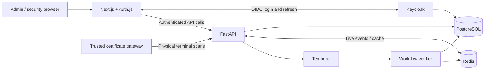

# IN / OUT Management System

A checkpoint management application for employee, visitor, and hardware entry/exit. Administrators manage records and permissions; security operators scan barcodes and act on access decisions. PostgreSQL stores movements and presence, while Keycloak handles login and roles.

[Features](#features) · [Architecture](#architecture) · [Quick start](#quick-start) · [Configuration](#configuration) · [Development](#development-and-testing) · [API](#api) · [Operations](#operations) · [Troubleshooting](#troubleshooting)

## Features

| Area | What it provides |
| --- | --- |
| Dashboard | Scan totals, entry/exit analytics, presence counts, and recent activity |
| Registry | Employees, temporary visitors, hardware assets, barcodes, status, and allowed zones |
| Permissions | Validity windows, visitor approvals, hardware custody, and manual access decisions |
| Security terminal | Barcode scanning, up to four optional carried-hardware barcodes, checkpoint selection, entry/exit controls, and persistent results |
| Movement logs | Search and filters, pagination, analytics, movement notes, and synchronization tools |
| Alerts and audit | Configurable rules, notifications, alert management, and audit history; scheduled evaluation every five minutes |
| Offline queue | Device-local scan storage and retry after reconnection; queued scans require a server decision before access is allowed |
| Account and appearance | Keycloak account security, SSO logout, administrator profile preferences, responsive layouts, and shared light/dark themes |

### Roles and pages

| Identity | Access |
| --- | --- |
| `admin` realm role | `/admin/dashboard`, `/admin/registry`, `/admin/permissions`, `/admin/logs`, `/admin/alerts`, `/admin/profile` |
| `operator` realm role | `/terminal` and its scan/manual-review workflow |
| Keycloak master administrator | Keycloak configuration and identity management; this does not automatically grant an application role |

Assign each application user one role. Administrators are deliberately excluded from terminal operations, including users assigned both roles. Keycloak login accounts and registry people are separate: creating a login does not register a person for checkpoint access.

### Scan and approval workflow

1. The operator selects a checkpoint, scans a person or asset barcode, and optionally adds carried hardware. Press **Enter** or **Check access**.
2. The backend checks registration, access status, validity, zone, presence, and applicable hardware custody. Automatic checkpoints derive direction from presence; manual checkpoints expose **Entry** and **Exit** controls.
3. The decision and movement are recorded in PostgreSQL. Approved movements update presence; enabled rules can generate alerts. Idempotency keys protect scan retries.
4. A denied scan can be sent for **manual approval**, with an optional operator note. An administrator decides it in Permissions; the terminal displays the updated status.
5. Manual entry approval atomically stores the identity, decision, movement, audit event, and presence. Its matching exit remains allowed even if normal entry access is restricted or expires. Exit consumes that visit's permission; future entry requires normal permission or another approval. Additional hardware is not covered by the original approval.

**Recent scans** and **Manual reviews** are filtered to the selected checkpoint. Account security and sign-out are in the terminal's account menu.

The offline queue uses IndexedDB in the same browser and device. Connect once to cache checkpoint and hardware configuration. Scans queue on supported connection failures, retain their idempotency keys, and retry after reconnection or through **Sync queued scans**. This is queued verification, not offline authorization; it does not guarantee the page can first load without a connection.

## Architecture



The browser uses the Next.js API layer; the server forwards access tokens to FastAPI. Keycloak credentials and refresh tokens are not exposed in public session responses. FastAPI verifies access-token signatures, issuer, audience, expiry, and roles, with signing-key refresh support. Physical terminals use a separate certificate-gateway path.

| Compose service | Technology / responsibility | Default local address |
| --- | --- | --- |
| `app` | Next.js 15, React 19, TypeScript, Auth.js; UI and API proxy | [localhost:1008](http://localhost:1008) |
| `python-api` | Python 3.10+, FastAPI, SQLAlchemy, asyncpg | [localhost:1002/docs](http://localhost:1002/docs) |
| `postgres-primary` | PostgreSQL 17; persistent storage | `localhost:1003` |
| `redis` | Redis 7; event publication and caches | `localhost:1004` |
| `keycloak` | OIDC identity provider; default image pin `26.2.5` | [localhost:1005/admin](http://localhost:1005/admin) |
| `temporal` / `temporal-ui` | Durable workflows and their inspection UI | gRPC `localhost:1006`; [UI localhost:1007](http://localhost:1007) |
| `backend-init` | Alembic migrations and reference seeding; exits on completion | Internal job |
| `temporal-worker` | Executes approval and alert activities | Internal service |
| `temporal-scheduler` | Registers the alert schedule; exits on completion | Internal job |

Application tables hold subjects, people/assets, permissions, requests, presence, movements, scan retry records, alerts, notifications, and audit events. Keycloak uses the `keycloak` schema in the `inout` database; Temporal uses separate databases on the same PostgreSQL service. Administrator profiles are associated with the Keycloak identity and do not store login passwords. The PostgreSQL volume persists across normal restarts. Independent local installations do not share accounts or records.

### Repository layout

```text
app/                  Next.js pages, layouts, authentication, and API routes
frontend/components/  Admin and terminal UI
frontend/context/     Shared state, refresh handling, and data actions
frontend/lib/         Persistent offline terminal queue
services/             Browser API clients
lib/                  Shared types, normalization, analytics, and session logic
backend/routers/      FastAPI endpoints
backend/workflows/    Temporal workflows and activities
backend/alembic/      Database migrations
backend/tests/        Policy, authentication, contract, and PostgreSQL tests
keycloak/             Realm import template
scripts/              Authentication checks and local realm repair
tests/                Frontend contract and authentication tests
docs/                 Operations, review findings, and Keycloak roadmap
compose.yaml          Local services and isolated test services
```

Dependency versions are recorded in [package-lock.json](package-lock.json) and [backend/uv.lock](backend/uv.lock). The frontend includes a targeted PostCSS override for the Next.js 15 dependency tree.

## Quick start

**Requirements:** Docker Desktop running, Node.js 22.5+ with npm, and a local checkout. The commands below use PowerShell from the repository root; Python runs inside Docker.

**1. Create configuration for a new installation.** Keep an existing `.env` when updating.

```powershell
Copy-Item .env.example .env
$authSecret = node -e "console.log(require('crypto').randomBytes(32).toString('base64url'))"
$clientSecret = node -e "console.log(require('crypto').randomBytes(32).toString('base64url'))"
(Get-Content .env) -replace '^AUTH_SECRET=.*$', "AUTH_SECRET=$authSecret" -replace '^KEYCLOAK_CLIENT_SECRET=.*$', "KEYCLOAK_CLIENT_SECRET=$clientSecret" | Set-Content .env
```

Set `POSTGRES_PASSWORD`, `KEYCLOAK_ADMIN_USERNAME`, and `KEYCLOAK_ADMIN_PASSWORD` in `.env`. The default application URL is `http://localhost:1008`. Never commit `.env`.

For an **existing realm**, keep its current client secret from **Clients → inout-frontend → Credentials**. Changing `.env` does not rotate the saved secret, and startup import does not overwrite an existing realm. Follow the [existing-realm rollout guide](docs/keycloak-review.md#applying-the-changes-to-an-existing-installation) when changing identity configuration.

**2. Build and start.**

```powershell
docker compose up --build -d
docker compose ps -a
```

`-d` runs services in the background. `backend-init` and `temporal-scheduler` should exit successfully; the API and worker remain running. Startup seeds reference checkpoints and alert rules, not application login users.

**3. Create application users.**

1. Open [Keycloak administration](http://localhost:1005/admin) using the master credentials from `.env`.
2. Select the `inout` realm, create a user under **Users**, and set a password under **Credentials**. For immediate local sign-in, turn **Temporary** off.
3. Assign the `admin` realm role under **Role mapping**, preserving default realm roles. Create a separate user with `operator` for terminal access.
4. Sign in at [localhost:1008](http://localhost:1008). After role changes, sign out and back in to obtain updated claims.

**4. Register subjects and operate the terminal.** Use the admin Registry and Permissions pages to create people/assets and configure access. Sign in as the operator to scan them at `/terminal`.

## Configuration

[.env.example](.env.example) lists settings; [compose.yaml](compose.yaml) defines which values each container receives.

| Setting | Purpose |
| --- | --- |
| `POSTGRES_PASSWORD` | Database credentials used by the stack; keep URL-embedded credentials correctly encoded |
| `AUTH_SECRET` | Encrypts/authenticates Auth.js session cookies |
| `AUTH_TRUST_HOST`, `ENV` | Auth.js host handling and backend environment; Compose supplies these for the local stack |
| `KEYCLOAK_ADMIN_USERNAME`, `KEYCLOAK_ADMIN_PASSWORD` | Bootstrap master credentials, used when Keycloak first initializes |
| `KEYCLOAK_CLIENT_ID`, `KEYCLOAK_CLIENT_SECRET` | Frontend client configuration; Compose uses `inout-frontend` and requires its matching secret |
| `AUTH_URL`, `APP_PORT` | Browser-facing application origin and Docker port; keep callback URLs consistent |
| `KEYCLOAK_VERSION`, `KEYCLOAK_PORT` | Server image pin and local identity-provider port |
| `KEYCLOAK_ISSUER`, `KEYCLOAK_ISSUER_PUBLIC`, `KEYCLOAK_JWKS_BASE`, `KEYCLOAK_AUDIENCE` | Token issuer, optional browser-facing issuer override, internal JWKS address, and required API audience |
| `KEYCLOAK_JWKS_CACHE_TTL` | Signing-key cache lifetime; default 300 seconds |
| `PYTHON_API_URL`, `DATABASE_URL`, `READ_DATABASE_URL` | API and database connections; an empty read URL uses the primary database |
| `REDIS_URL`, `TEMPORAL_HOST` | Cache/event and workflow connections |
| `PYTHON_API_PORT`, `POSTGRES_PORT`, `REDIS_PORT`, `TEMPORAL_PORT`, `TEMPORAL_UI_PORT` | Host port overrides for the addresses above |
| `MTLS_PROXY_SECRET` | Shared secret for a trusted physical-terminal certificate gateway |
| `MAX_REQUEST_BODY_BYTES`, `WRITE_RATE_LIMIT_PER_MINUTE` | API limits; defaults are 262,144 bytes and 300 writes/minute per client address per process |
| `*_RETENTION_DAYS` | Maintenance windows: retry records 30 days, notifications 90; audit events, alerts, and movements default to indefinite retention (`0`) |

Compose supplies internal service addresses; host-side development uses localhost addresses. Backend settings are defined in [backend/config.py](backend/config.py). Settings not forwarded in a service's `environment` must be passed explicitly, for example with `docker compose run -e NAME=value ...`; adding a value to the root `.env` alone does not automatically inject it into every container.

## Development and testing

Install host-side dependencies with `npm ci`. Keep Docker backend services running, then start the frontend with its development callback origin:

```powershell
$env:AUTH_URL = "http://localhost:1001"
npm run dev
```

Open [localhost:1001](http://localhost:1001). The realm template includes this callback; an existing realm must have it registered. Use `npm run dev:webpack` for the Webpack development server. Remove the temporary override with `Remove-Item Env:AUTH_URL` before returning to the Docker application URL. Backend code changes require rebuilding its services through `docker compose up --build -d`.

| Command | Verification |
| --- | --- |
| `npm run typecheck` | TypeScript types |
| `npm test` | Data contracts, session/token handling, and realm-repair behavior |
| `npm run build` | Production frontend build |
| `npm run test:auth:http` | HTTP authentication using isolated identity/API stubs; run after building |
| `npm run test:postgres` | Backend suite, migrations, and transaction behavior against isolated PostgreSQL |
| `npm run test:auth:account` | Live local Keycloak account endpoints and role boundaries; creates and removes a temporary test identity |

PostgreSQL tests use the `test` Compose profile, a separate temporary database, and a schema per database test. They require Docker and the Compose configuration values. Stop the test service afterward with `docker compose --profile test stop db-test`. The live account check additionally requires the running local stack and matching credentials in `.env`.

[GitHub Actions](.github/workflows/verify.yml) runs frontend type checks, tests, and build, plus the isolated backend suite on pull requests and pushes to `main`.

## API

The browser calls `/api/data`, `/api/profile`, and `/api/presence` through Next.js. Direct clients use FastAPI's `/v1` routes with a Keycloak **access token** containing the required role and audience.

| Endpoint group | Purpose / access |
| --- | --- |
| `/v1/terminal/bundle`, `/v1/terminal/scans`, `/v1/terminal/manual-reviews` | Operator bootstrap, scans, and manual-review submission |
| `/v1/scans` | Physical terminal scans through the trusted certificate gateway |
| `/v1/registry/subjects` | Registry reads and writes; authorization depends on the operation |
| `/v1/permissions`, `/v1/permission-requests` | Permission management and request/decision workflows |
| `/v1/movements`, `/v1/dashboard` | Administrator movement history, notes, analytics, and dashboard data |
| `/v1/alerts`, `/v1/alert-rules`, `/v1/notifications`, `/v1/audit-events` | Administrator alerts, rules, notifications, and audit trail |
| `/v1/checkpoints`, `/v1/admin/profile` | Administrator checkpoint listing and profile preferences |
| `/v1/presence`, `/v1/presence/stream` | Authenticated presence snapshots and server-sent events |

Scan requests require a UUID `Idempotency-Key` header. Reuse it only when retrying the same scan; a changed payload returns `409`. Use [Swagger UI](http://localhost:1002/docs) for exact methods, payloads, and responses, or import the [Postman collection](inout_api_collection.postman_collection.json). Postman uses the `inout-postman` Authorization Code with PKCE client; see [token setup](docs/operations.md#postman). Existing realms need that client configured.

## Operations

| Task | Command |
| --- | --- |
| Start or apply code/configuration updates | `docker compose up --build -d` |
| Inspect services and completed jobs | `docker compose ps -a` |
| Follow logs | `docker compose logs -f` |
| Stop while preserving data | `docker compose stop` |
| Restart stopped services | `docker compose start` |
| Check historical manual admissions | `docker compose exec -T python-api python repair_manual_entries.py` |
| Preview configured retention cleanup | `docker compose run --rm backend-init python -m maintenance cleanup` |

Migrations run in `backend-init`; restarting only `python-api` does not apply them. Historical repair defaults to a read-only check. After a backup, add `--apply` to link older approvals and restore presence; incomplete profiles receive restricted placeholders. Retention cleanup also requires `--apply` to delete records and is not automatically scheduled. Review the output and configured windows first.

### Backup and reset

Create a custom-format backup of application and Keycloak data without piping binary output through PowerShell:

```powershell
New-Item -ItemType Directory -Force .data/backups | Out-Null
docker compose exec -T postgres-primary pg_dump -U inout -d inout -Fc -f /tmp/inout.dump
docker compose cp postgres-primary:/tmp/inout.dump .data/backups/inout.dump
```

Use a distinct filename for each backup. This dump covers the `inout` database; Temporal databases need separate backups for complete workflow recovery. Rehearse restoration into a separate empty database:

```powershell
docker compose cp .data/backups/inout.dump postgres-primary:/tmp/inout-restore.dump
docker compose exec -T postgres-primary createdb -U inout inout_restore
docker compose exec -T postgres-primary pg_restore -U inout -d inout_restore --no-owner /tmp/inout-restore.dump
```

Verify the restored records before planning a deployment cutover.

`docker compose down -v` deliberately **deletes the database volume, including application records, Keycloak users, and Temporal data**. Start again with the normal build command for a fresh installation.

### Deployment boundaries

This Compose stack is for local development: services bind to loopback and Keycloak runs with `start-dev`. A shared deployment needs HTTPS, production Keycloak settings, managed secrets, backups, and gateway rate limits. A certificate gateway must strip incoming `X-Client-*` and `X-Proxy-Secret` headers and supply verified values itself. Browser offline storage is not a database backup. MFA, directory federation, back-channel logout, and other advanced identity features remain proposals in the [Keycloak roadmap](docs/keycloak-review.md), not features enabled by this setup.

## Troubleshooting

| Symptom | Check / action |
| --- | --- |
| Service fails to start | Run `docker compose ps -a` and inspect that service's logs; initialization jobs should exit with code 0 |
| Login callback or client-secret error | Match `AUTH_URL`, registered redirect URLs, public issuer, and the existing frontend client's secret |
| API `401` / `403` | `401`: missing/invalid/expired token or wrong audience. `403`: role mismatch; sign in again after changing roles |
| Account Console `401` | Run `npm run keycloak:account:check`; if configuration is missing, run `npm run keycloak:account:repair` and obtain a fresh session |
| Keycloak iframe sandbox warnings | These cookie/session iframe warnings are separate from Account Console authorization failures |
| Scan stays queued | Restore the connection, check the API/session, and use **Sync queued scans**; do not treat queued status as approval |
| No registered people/assets | Fresh startup seeds reference data only; create operational records in the admin Registry |
| Old manual approval cannot exit | Back up, run the historical-admission check, then apply the repair when indicated |

Health checks: [frontend](http://localhost:1008/api/health), [API liveness](http://localhost:1002/health/live), and [API readiness](http://localhost:1002/health/ready). Readiness checks PostgreSQL, Redis, and Temporal. Keycloak repair adds missing self-service role composites and restores the API audience mapper if absent; it does not replace a complete realm migration.

## Detailed documentation

- [Backend function map](BACKEND_FUNCTION_MAP.md): endpoints, core functions, data models, and workflows.
- [Operations](docs/operations.md): deployment guidance, Postman, and retention maintenance.
- [Keycloak review and roadmap](docs/keycloak-review.md): authentication design, existing-realm rollout, and proposed advanced features.
- [Project review](docs/project-review.md): September 2026 defect fixes, historical repair, and recorded validation results.
